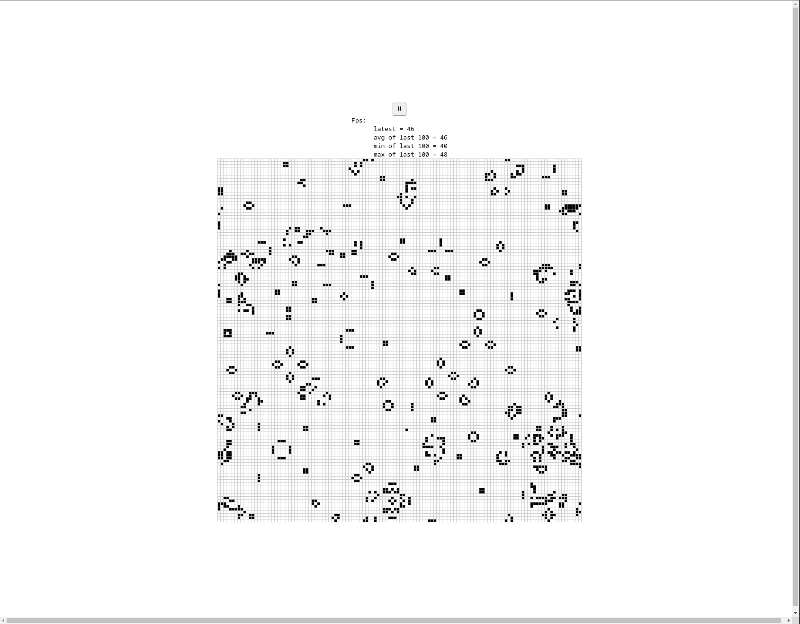

# Game of life 

Implementation of Conway's Game of Life in Rust.

## Build
To compile `wasm` binary [wasm-pack](https://rustwasm.github.io/wasm-pack/installer/) is required:
```bash
$ wasm-pack build
```
To start a server with [npm](https://docs.npmjs.com/getting-started), go to the `www` directory and run:
```bash
$ cd www
$ npm install
$ npm run start
```

## Examples

